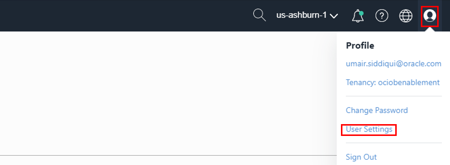

# Deploying and configuring Autonomous Data Warehouse

## Introduction

Oracle Autonomous Data Warehouse Cloud provides an easy-to-use, fully autonomous database that scales elastically, delivers fast query performance and requires no database administration. In this hands on lab, we will walk through deploying an Autonomous Data Warehouse database and loading a table using a text file that is stored in object storage. The purpose of this lab is to get familiar with Oracle Autonomous Data Warehouse primitives. At the end of this lab, you will be familiar with launching an Autonomous Data Warehouse database, creating an object storage bucket and loading a table using a text file stored in object storage

**Some Key points:**

*We recommend using Chrome or Edge as the broswer. Also set your browser zoom to 80%*

- All screen shots are examples ONLY. Screen shots can be enlarged by Clicking on them

- Login credentials are provided later in the guide (scroll down). Every User MUST keep these credentials handy.

- Do NOT use compartment name and other data from screen shots.Only use  data(including compartment name) provided in the content section of the lab

- Mac OS Users should use ctrl+C / ctrl+V to copy and paste inside the OCI Console

- Login credentials are provided later in the guide.

    **Note:** OCI UI is being updated often, thus some screenshots in the instructions might be different to the latest UI.

### Prerequisites

1. [OCI Training](https://cloud.oracle.com/en_US/iaas/training)
   
2. [Familiarity with OCI console](https://docs.us-phoenix-1.oraclecloud.com/Content/GSG/Concepts/console.htm)

3. [Overview of Networking](https://docs.us-phoenix-1.oraclecloud.com/Content/Network/Concepts/overview.htm)

4. [Familiarity with Compartments](https://docs.us-phoenix-1.oraclecloud.com/Content/GSG/Concepts/concepts.htm)

5. [Connecting to a compute instance](https://docs.us-phoenix-1.oraclecloud.com/Content/Compute/Tasks/accessinginstance.htm)

6. [**Download and install Oracle SQL Developer**](https://www.oracle.com/tools/downloads/sqldev-v192-downloads.html)


## **Step 1:** Sign in to OCI Console and create ADW instance

1. Sign in using your tenant name, user name and password.

2. From the OCI Services menu, Click **Autonomous Data Warehouse** under **Database** and then **Create Autonomous Database**.
    

3. Fill out the dialog box:

      - COMPARTMENT: Choose your assigned workshop compartment
      - DISPLAY NAME: Provide a name, for ex. **YourName-ADW**
      - DATABASE NAME: Leave it by default
      - Choose a Workload type: Data Warehouse
      - Choose a Deployment type: Shared Infrastructure

    
      
      Under **Configure the database**

      - Always Free: Leave Default (unchecked)
      - Choose database version: Leave Default
      - OCPU count: 1
      - Auto Sclaing: Make sure flag is **Un-checked**

          

      Under **Create administrator credentials**

      - Password: Provide a password (example: **Oracle123!!!!**)
      - Confirm Password: Confirm the password provided

      Under **Choose network access**

      - Allow secure accces from anywhere: Make sure this option is **checked**
      - Confifure access conrol rules: Leave default (unchecked)

      Under **Choose a license type**

      - License Included: Check this option

    

4. Click **Create Autonomous Database** - this should take couple of minutes.

We now have a Autonomous Data Warehouse instance created and running. Next we will create a Data file and use Object storage to upload it to Database instance.
              
## **Step 2:** Create Auth token for the user to connect to ADW and load data

In this section we will generate an authentication token for the user of this lab. An Auth token is an Oracle-generated token that you can use to authenticate with third-party APIs and Autonomous Database instance.

1. In OCI console Click the user icon (top right corner)  then **User settings**. Under Resrouces Click **Auth Token**, then **Generate Token**. In pop up window provide a description then Click **Generate Token**.




2.  Click **Copy** and save the token (for example in Notepad). **Do not close the window without saving the token as it can not be retrieved later**.


3. Note down your OCI user name.

    **Next we will connect to this ADW instane using SQL developer Web.**

## **Step 3: Load the data**

1. Return to you Autonomous database page (Main Menu > Autonomous Data Warehouse > your database)

Open second tab "Tools" and launch SQL developer Web - it will open in a new browser window


2. Connect with the user "ADMIN" and the password selected at ADW instance creation


3. Declare your Object Storage credenitals. Copy and paste the commands below:

```
Begin
    DBMS_CLOUD.create_credential (
        credential_name => 'OCI_CRED_NAME',
        username => '<YOUR_USER_NAME>',
        password => '<AUTH_TOKEN>'
    );
end;
```

**NOTE:** user name should be your **OCI console user name** and password should be the user's **Auth Token** generated earlier in this lab.


4. Execute the procedure (press the **Run Statement** button at the top) and verify the **PL/SQL Procedure successfully completed** message is displayed.


5. Create a new table (We will load data from file in Object Storage into this table). Copy and paste the following commands and execute in the worksheet

```
CREATE TABLE CHANNELS (
NAME VARCHAR2(20) NOT NULL,
gender VARCHAR2(20) NOT NULL,
NAME_total NUMBER NOT NULL );
```

6. Verify **Table CHANNELS created** message


7. Load data from file in Object Storage to newly created table.

    **NOTE:** A data file with 1000s of records already exists in OCI Object storage and we will use this file records to populate ADW From the ADW-File.txt content. Copy and paste the commands below:

```
begin
    dbms_cloud.copy_data(
        table_name =>'CHANNELS',
        credential_name =>'OCI_CRED_NAME',
        file_uri_list =>'https://objectstorage.us-ashburn-1.oraclecloud.com/p/V1pwPT-xupKEp4w6bgL31hIGJlqAjkke1vZFUTGmenM/n/us_training/b/Lab-images/o/century_names_new.txt',
        format => json_object('delimiter' value ',', 'trimspaces' value 'lrtrim')
    );
end;
```

8. Execute the procedure and verify **PL/SQL Procedure successfully completed** message (the import  should take around 20 seconds)


9. In SQL Developer, we will now query the table and veirfy the data - to do this, enter the command:

```
select * from channels
order by name_total desc;
```


We have successfully deployed a Autonomous Data Warehouse instance,populated a table using a file stored in Object storage and successfully run a query against the table.

## **Step 4:** Delete the resources

Delete Auth Token and Autonomous Data Warehouse

1. Navigate to User Settings ,Click **Auth Token** and Click **Delete** for your Auth Token by Hovering your mouse over action icon (Three Dots).
    

2. Navigate to Autonomoud Data Warehouse menu, Hover over the action icon(Three dots) and Click **Terminate**.
    


*Congratulations! You have successfully completed the lab.*

## Acknowledgements


- **Author** - Flavio Pereira, Larry Beausoleil
- **Adapted by** -  Yaisah Granillo, Cloud Solution Engineer
- **Last Updated By/Date** - Yaisah Granillo, June 2020

If you do not have an Oracle Account, click [here](https://profile.oracle.com/myprofile/account/create-account.jspx) to create one.
