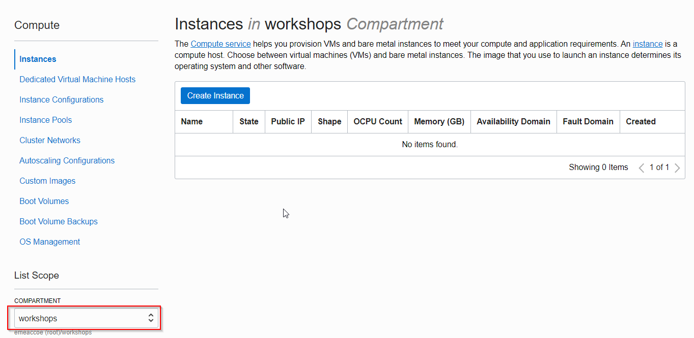
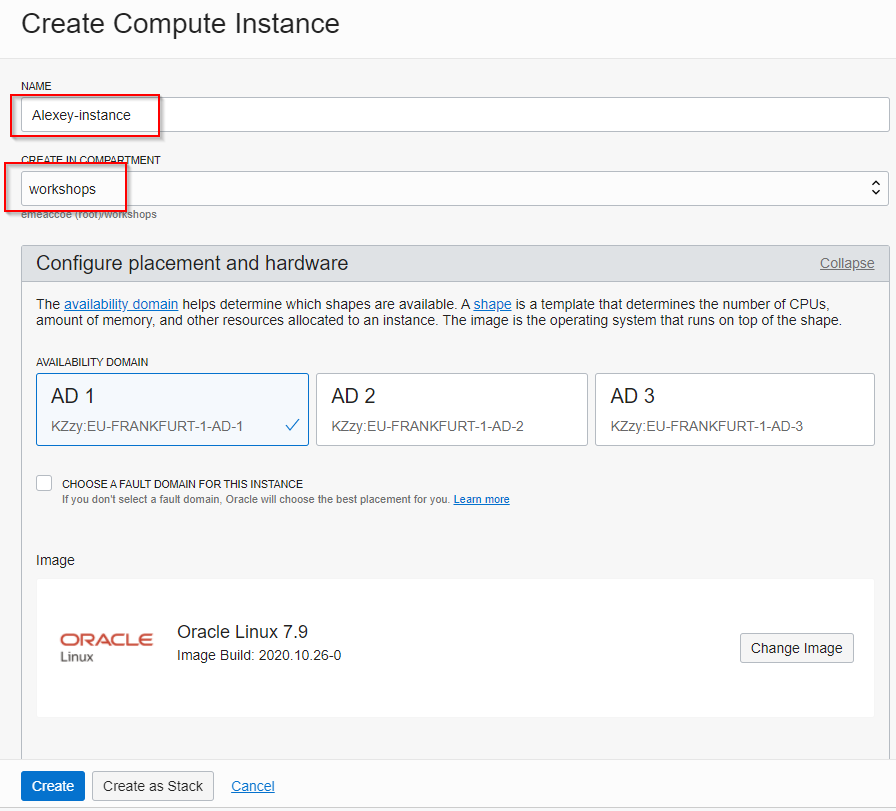
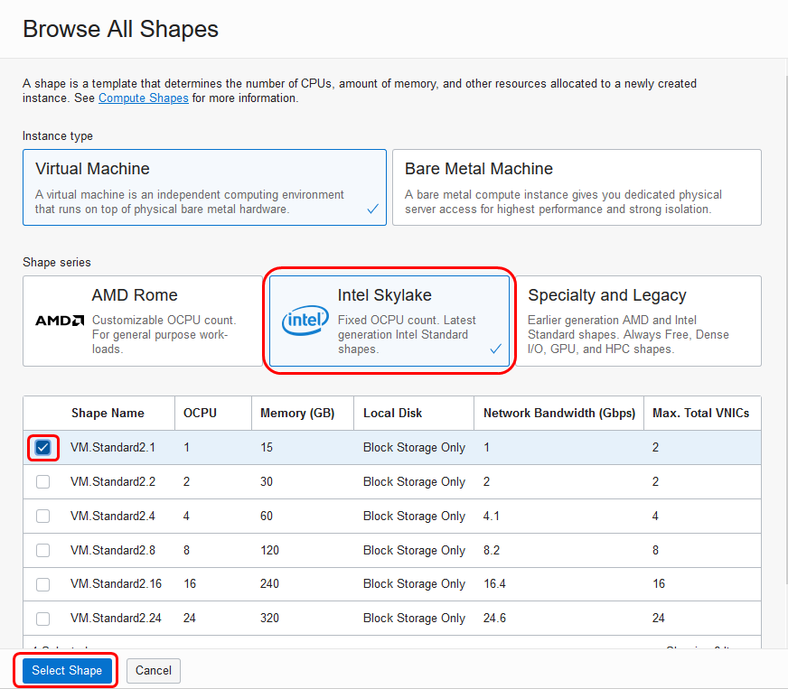
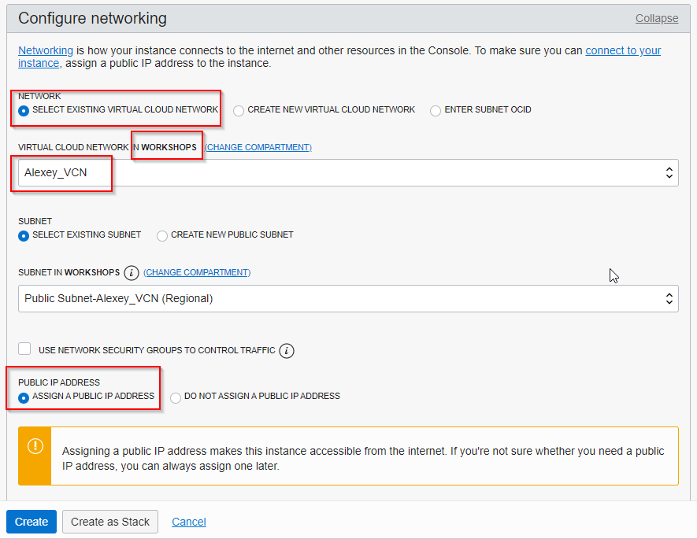
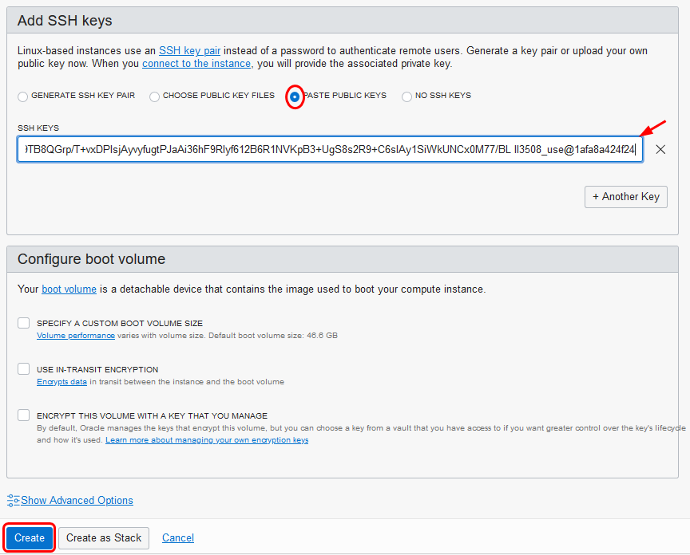
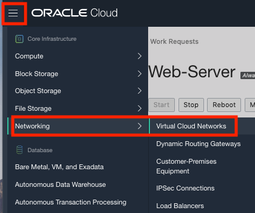
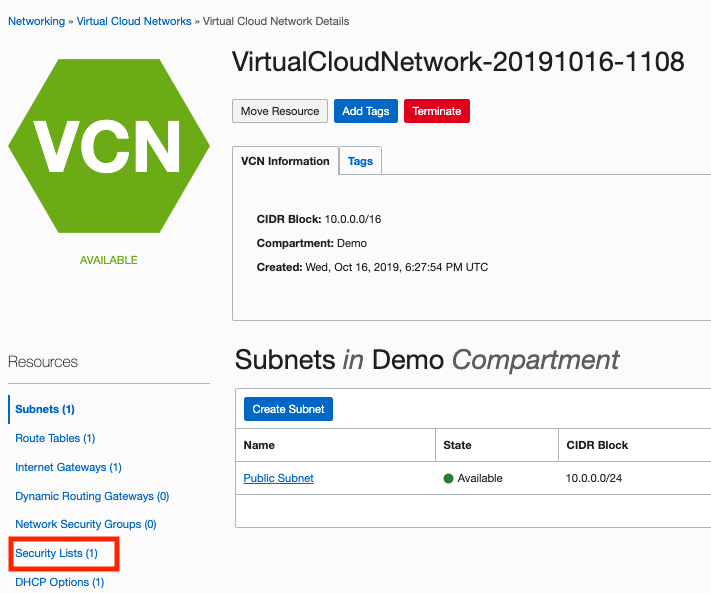
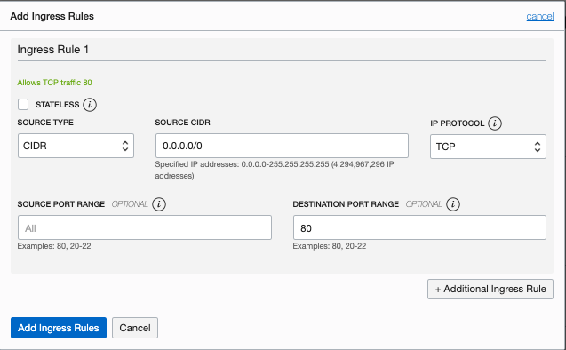

# Create a Compute Service

## Introduction

Oracle Cloud Infrastructure Compute lets you provision and manage compute hosts, known as instances. You can launch instances as needed to meet your compute and application requirements. After you launch an instance, you can access it securely from your computer, restart it, attach and detach volumes, and terminate it when you're done with it. Any changes made to the instance's local drives are lost when you terminate it. Any saved changes to volumes attached to the instance are retained.

Be sure to review [Best Practices for Your Compute Instance](https://docs.cloud.oracle.com/iaas/Content/Compute/References/bestpracticescompute.htm) for important information about working with your Oracle Cloud Infrastructure Compute instance.

### Prerequisites

- Oracle Cloud Infrastructure account credentials (User, Password, and Tenant)
- To sign in to the Console, you need the following:
  - Tenant, User name and Password
  - Oracle Cloud Infrastructure supports the latest versions of Google Chrome, Firefox and Internet Explorer 11

## **STEP 1**: Creating <if type="freetier">a Web Server on </if>a Compute Instance

Oracle Cloud Infrastructure  offers both Bare Metal and Virtual Machine instances:

- **Bare Metal**  - A bare metal compute instance gives you dedicated physical server access for highest performance and strong isolation.
- **Virtual Machine**  - A Virtual Machine (VM) is an independent computing environment that runs on top of physical bare metal hardware. The virtualization makes it possible to run multiple VMs that are isolated from each other. VMs are ideal for running applications that do not require the performance and resources (CPU, memory, network bandwidth, storage) of an entire physical machine.

An Oracle Cloud Infrastructure VM compute instance runs on the same hardware as a Bare Metal instance, leveraging the same cloud-optimized hardware, firmware, software stack, and networking infrastructure.

1. Navigate to the **Compute** tab and select **Instances**.

2. Select the Compartment that you were assigned when the reservation was created.

  


2. Then click **Create Instance**. We will launch a VM instance for this lab.

3. The Create Compute Instance wizard will launch.
Enter your username + *-Instance* as the name of the server.




4. Click *Change Shape* to choose a different VM shape.

    

5. Select *Intel Skylake*, then select **VM.Standard.2.1** as the shape, and click **Select Shape**.

    

3. In the Networks section, choose "Select Existing Virtual Network" and select the VCN you've created in the previous lab. Then, you will need to scroll down to the Configure Networking area of the page and select the *Assign a public IP address* option.

    

    ***NOTE:*** *You need a public IP address so that you can SSH into the running instance later in this lab.*

4. Scroll down to the SSH area of the page. Select "Paste Public Keys" and paste from Cloud Shell the contents of the **public** SSH key that you've created earlier in ***Generate SSH Keys*** Lab. Press the **Create** button to create your instance.

    

    Launching an instance is simple and intuitive with few options to select. The provisioning of the compute instance will complete in less than a minute and the instance state will change from provisioning to running.

5. Once the instance state changes to Running, you can SSH to the Public IP address of the instance. The Public IP address is noted under *Instance Access*.

    


## **STEP 2**: Connect to the instance and install Apache HTTP Server

1. To connect to the instance, use Cloud Shell and enter the following command:

    **Note:** For Oracle Linux VMs, the default username is **opc**. In this example, the private key file is **mykey**

    ```
    ssh -i ~/.ssh/mykey opc@<public_ip_address>
    ```

    type "yes" if a message `Are you sure you want to continue connecting (yes/no)?` appears.
    
2. For this lab, we are going to install an Apache HTTP Webserver and try to connect to it over the public Internet. SSH into the Linux instance and run following commands:

    *Note: Apache HTTP Server is an open-source web server developed by the Apache Software Foundation. The Apache server hosts web content, and responds to requests for this content from web browsers such as Chrome or Firefox.*

    - Install Apache http

      ```
      sudo yum makecache && sudo yum install httpd -y
      ```

    - Start the apache server and configure it to start after system reboots

      ```
      sudo apachectl start
      sudo systemctl enable httpd
      ```

    - Run a quick check on apache configurations

      ```
      sudo apachectl configtest
      ```

    - Create firewall rules to allow access to the ports on which the HTTP server listens.

      ```
      sudo firewall-cmd --permanent --zone=public --add-service=http
      sudo firewall-cmd --reload
      ```

    - Create an index file for your webserver

      ```
      sudo bash -c 'echo This is my Web-Server running on Oracle Cloud Infrastructure >> /var/www/html/index.html'
      ```

3. Open your browser and navigate to `http://Public-IPAddress` (the public IP address of the Linux VM)

    **NOTE: Your browser will time out and not return anything because port 80 was not opened into the Security Lists yet!**

4. Using the menu, click on **Virtual Cloud Network** and then open the VCN you created for this practice.

    

5. Now click on **Security Lists** on the left navigation bar for the VCN.
    

6. Click on the **Default Security List**.

7. Here you need to open port 80. Click on **Add Ingress Rules** and add the following values as shown below:

    - **Source Type:** CIDR
    - **Source CIDR**: 0.0.0.0/0
    - **IP Protocol:** TCP
    - **Source Port Range:** All
    - **Destination Port Range:** 80
    - Click on **Add Ingress Rules** at the bottom.

    

8. Navigate to `http://<public_ip_address>` (the public IP address of the Linux VM) in your browser. And now you should see the index page of the webserver we created above.

    

## Troubleshooting

If you are unable to see the webserver on your browser, possible scenarios include:

- VCN Security Lists is blocking traffic, Check VCN Security List for ingress rule for port 80
- Firewall on the linux instance is blocking traffic

  - `sudo firewall-cmd --zone=public --list-services` (this should show http service as part of the public zone)
  - `sudo netstat -tulnp | grep httpd` (an httpd service should be listening on the port 80, if it’s a different port, open up that port on your VCN SL)

- Your company VPN is blocking traffic


*You have completed this lab, you may proceed* [**to the next one**](block-volume.md).

## Acknowledgements

- **Author** - Flavio Pereira, Larry Beausoleil
- **Adapted by** -  Tom McGinn, Database Product Management
- **Contributors** - Oracle LiveLabs QA Team (Kamryn Vinson, QA Intern, Arabella Yao, Product Manager Intern, DB Product Management)
- **Last Updated By/Date** - Tom McGinn, October 2020

If you do not have an Oracle Account, click [here](https://profile.oracle.com/myprofile/account/create-account.jspx) to create one.